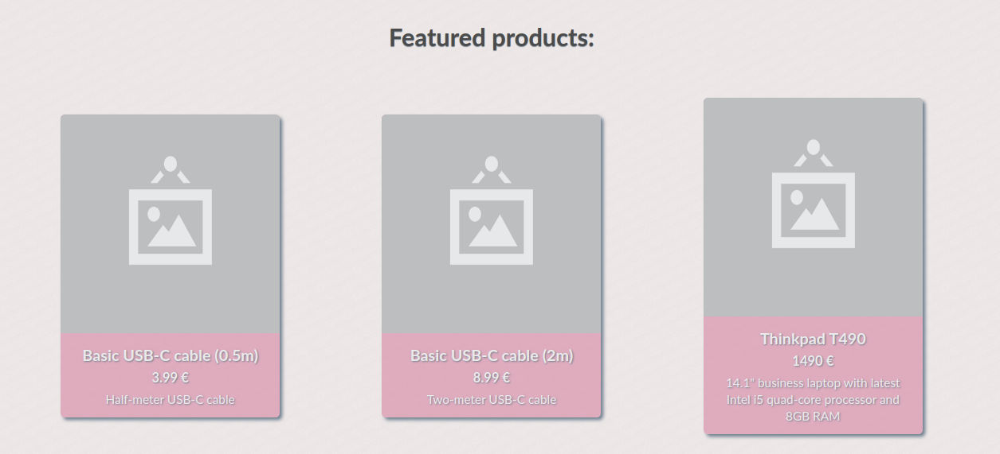
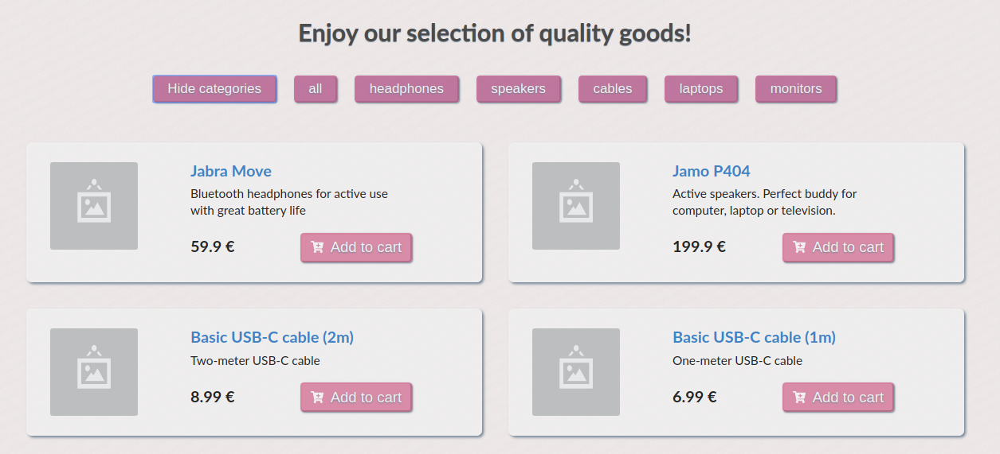
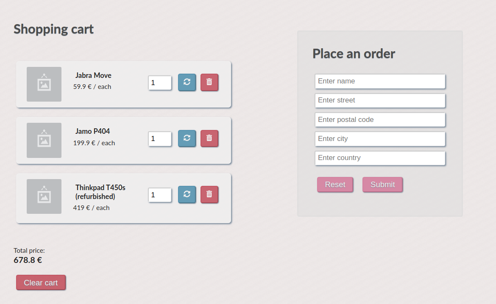
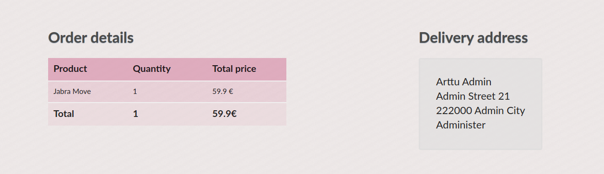
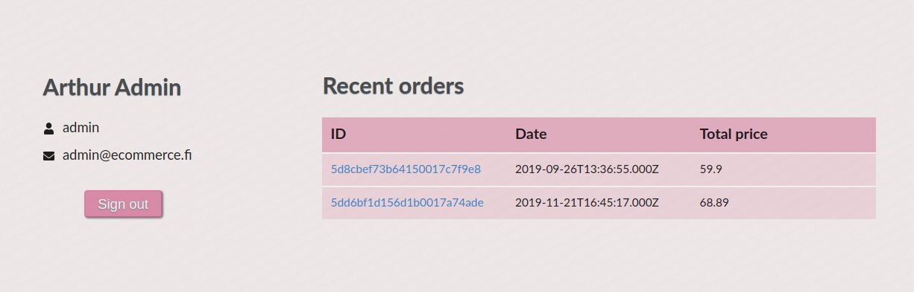
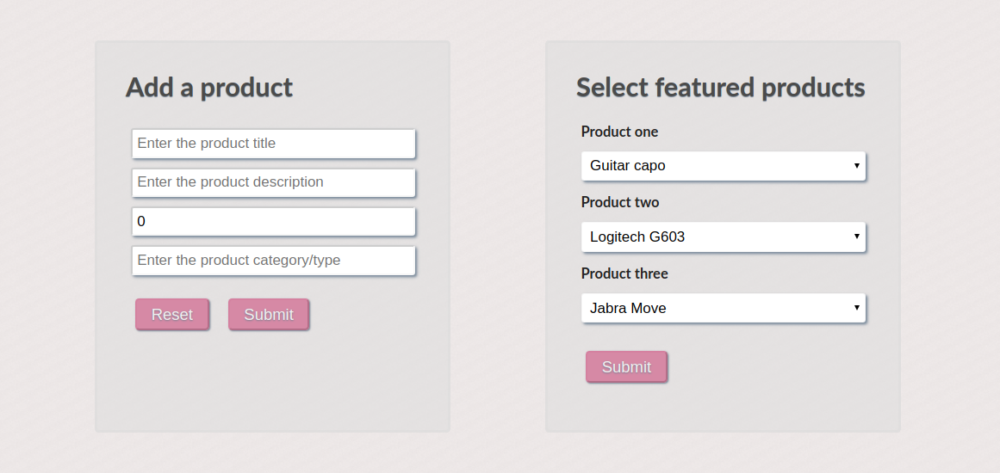
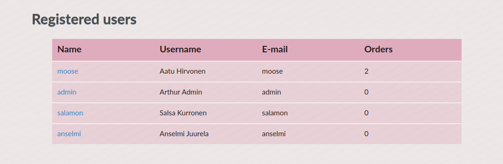
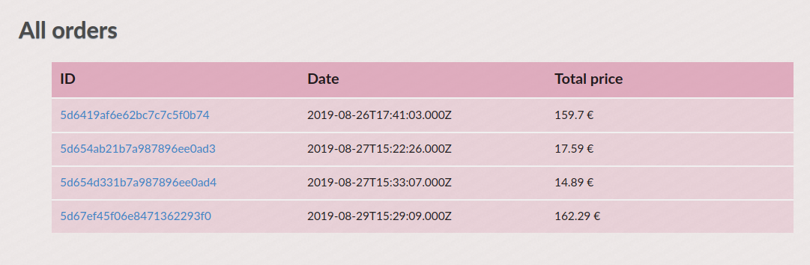

# Frontend verkkokauppa-alustalle

Backend löytyy [täältä.](https://github.com/hirvoin/ecommerce-backend)

## Tietoa

Yksinkertainen verkkokauppaprojekti omaksi ilokseni. Päällimmäistarkoituksena omien ohjelmointitaitojen kehittäminen ja ylläpito. Sovellus on alunperin tyylitelty käyttäen Semantic UI- kirjastoa, mutta käytin hyvän oppimistilaisuuden hyväkseni, ja siirryin käyttämään kotikutoista CSS:ssää styled-components -kirjaston avulla. Semantic UI -versio kuitenkin nähtävillä branchissa [semantic](https://github.com/hirvoin/ecommerce-frontend/tree/semantic).

Projektissa on käytetty esimerkiksi seuraavia teknologioita:

- React.js
- Tyylittelyyn käytetty styled-components- + react-icons kirjastoja
- Lomakkeet luotu Formik + Yup yhdistelmällä
- node.js + MongoDB backend

## Verkkokauppa sisältää seuraavat toiminnallisuudet

- Admin-paneeli sisältäen tuotteiden, tilausten ja käyttäjien hallintamahdollisuuden
- Näkymä tuotteille kategorioittain
- Ostoskori
- Tilauksen tekeminen (Stripe-integraatio tulossa lähitulevaisuudessa)
- Käyttäjän luominen
- Kolmen tuotteen näyteikkuna etusivulla (implementaatio työn alla)

## Kuvia

### Kustomoitava kolmen tuotteen näyteikkuna

### Tuotelistaus

### Ostoskori

### Yksittäisen tilauksen tiedot

### Käyttäjätiedot

### Tuotteen lisäyslomake ja näyteikkunan tuotteiden valinta ylläpitäjille

### Lista rekisteröityneistä käyttäjistä ylläpitäjille

### Lista tehdyistä tilauksista ylläpitäjille

